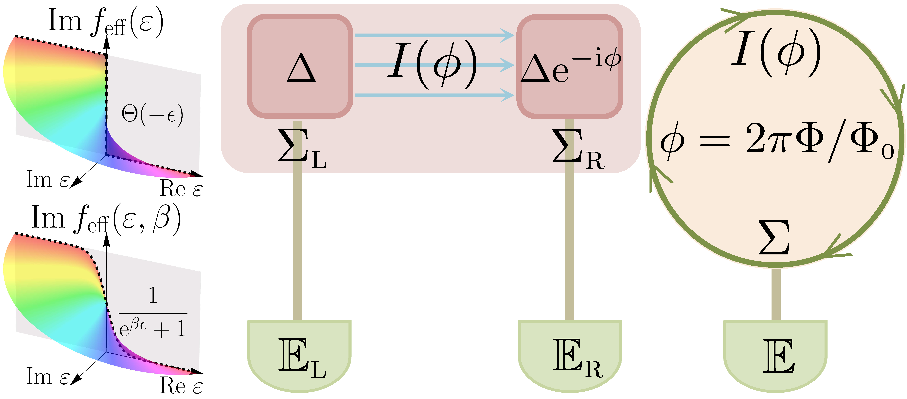

[](https://www.wolfram.com/mathematica/)
[](https://wolfr.am/1mXmN5DaF)

# Non-Hermitian Fermi-Dirac Distribution in Persistent Current Transport



This repository contains the code developed to accompany the manuscript titled *Non-Hermitian Fermi-Dirac Distribution in Persistent Current Transport* [[1](#refer-anchor-1)].

## Contents

- `SNS.ipynb`: A phase-biased superconducting-normal-superconducting (SNS) junction.
- `Ring.ipynb`: A normal ring threaded by a magnetic flux.
- `NonHermitianFermiDiracPersistentCurrent.nb`: *Mathematica* notebook ([view online](https://wolfr.am/1mXmN5DaF)) for symbolic derivation of the non-Hermitian Fermi-Dirac distribution and relevant analytical calculations.

## Usage

To run the Jupyter notebooks, ensure you have [DMRGpy](https://github.com/joselado/dmrgpy) installed. Each notebook is self-contained and provides step-by-step computation leading to the ground state energy and persistent current as a function of the phase. The analysis focuses on the influence of many-body interactions on the persistent currents and scrutinizes the signatures of exceptional points within these systems.

For the *Mathematica* notebook, we demonstrate the symbolic derivation of our formalism, including:
- Derivation and visualization of the non-Hermitian Fermi-Dirac distribution.
- Continuity of the persistent current at exceptional points.
- Analytical expressions and and numerical verifications for Green's function.

## References

<div id="refer-anchor-1"></div> 

[1] P.-X. Shen, Z. Lu, J. L. Lado, and M. Trif, [*Non-Hermitian Fermi-Dirac Distribution in Persistent Current Transport*](https://arxiv.org/abs/2403.09569), [Phys. Rev. Lett](https://doi.org/10.1103/PhysRevLett.133.086301). **133**, 086301 (2024).

## Citation

If you use this code or notebook in your research, please cite our Letter:

```bibtex
@article{Shen2024NonHermitian,
  title = {Non-{{Hermitian Fermi-Dirac Distribution}} in {{Persistent Current Transport}}},
  author = {Shen, Pei-Xin and Lu, Zhide and Lado, Jose L. and Trif, Mircea},
  year = {2024},
  month = aug,
  volume = {133},
  number = {8},
  pages = {086301},
  publisher = {American Physical Society},
  doi = {10.1103/PhysRevLett.133.086301},
  journal = {Physical Review Letters}
}
```